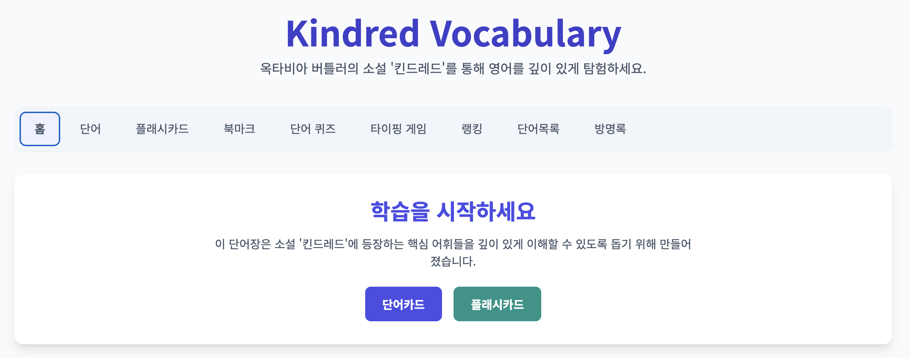
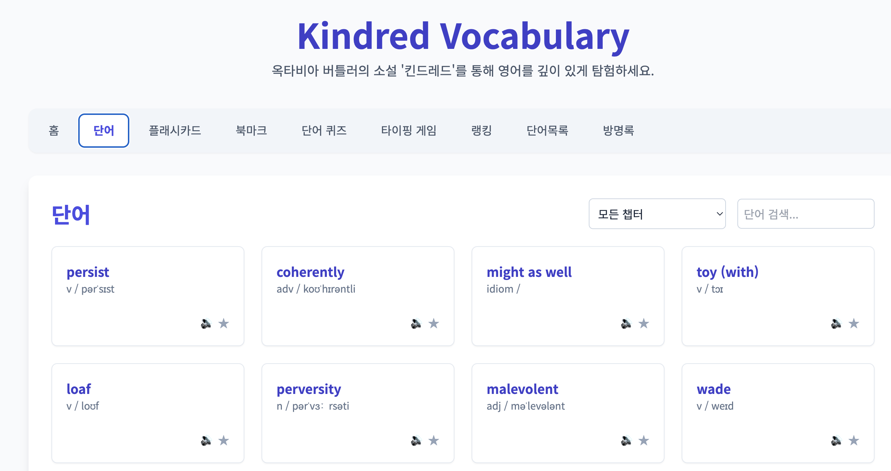
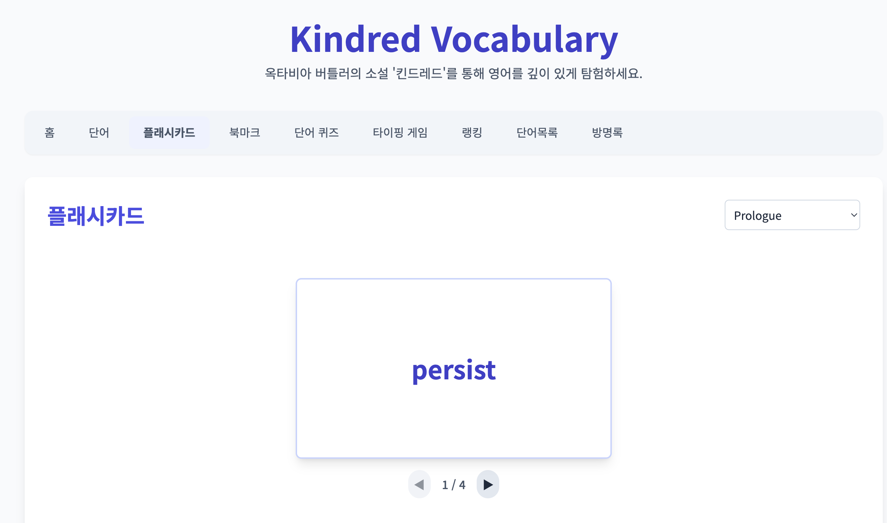
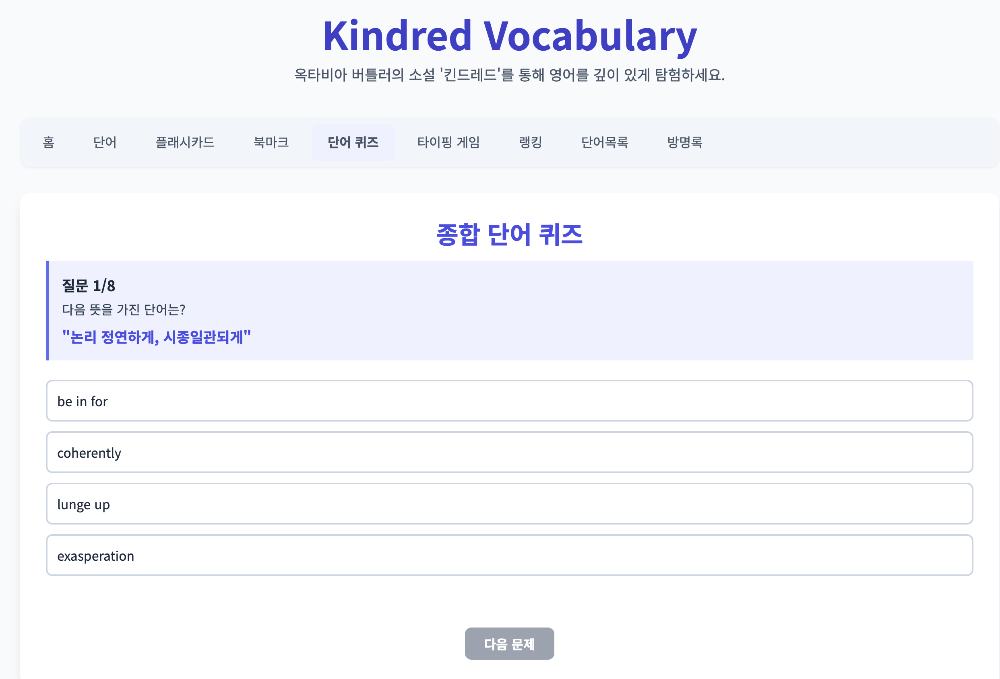
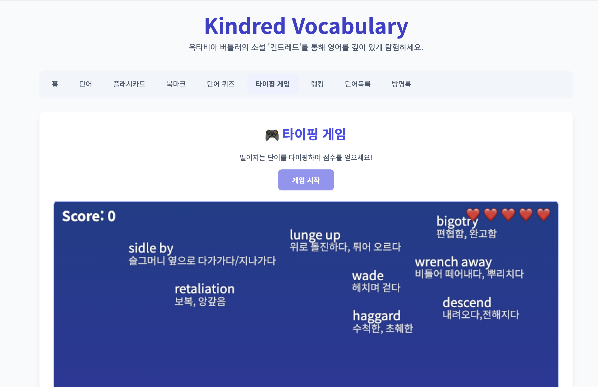
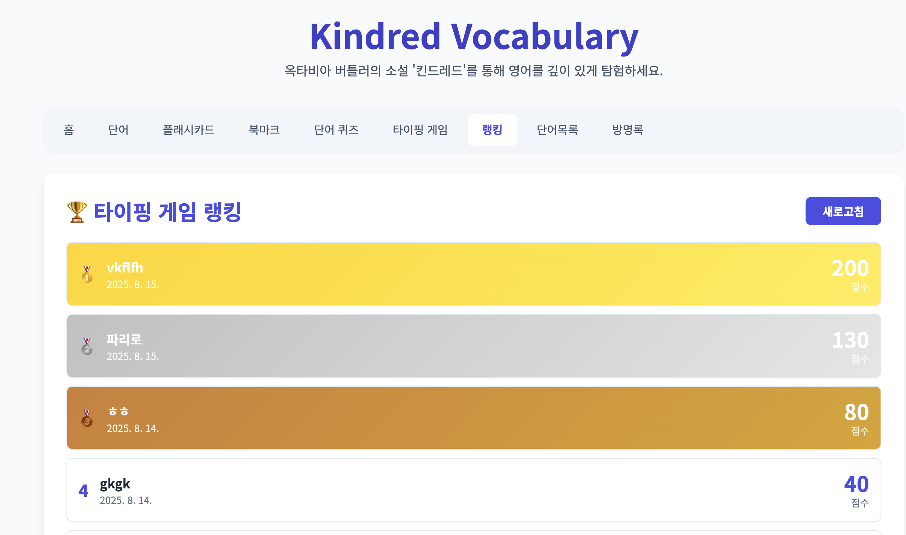
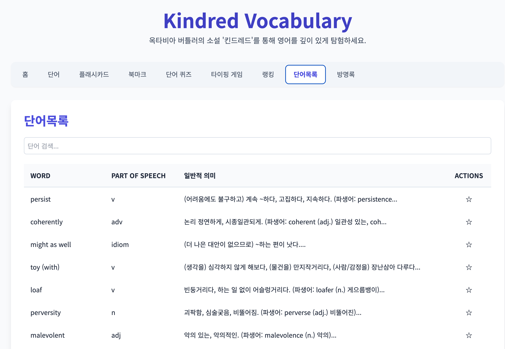
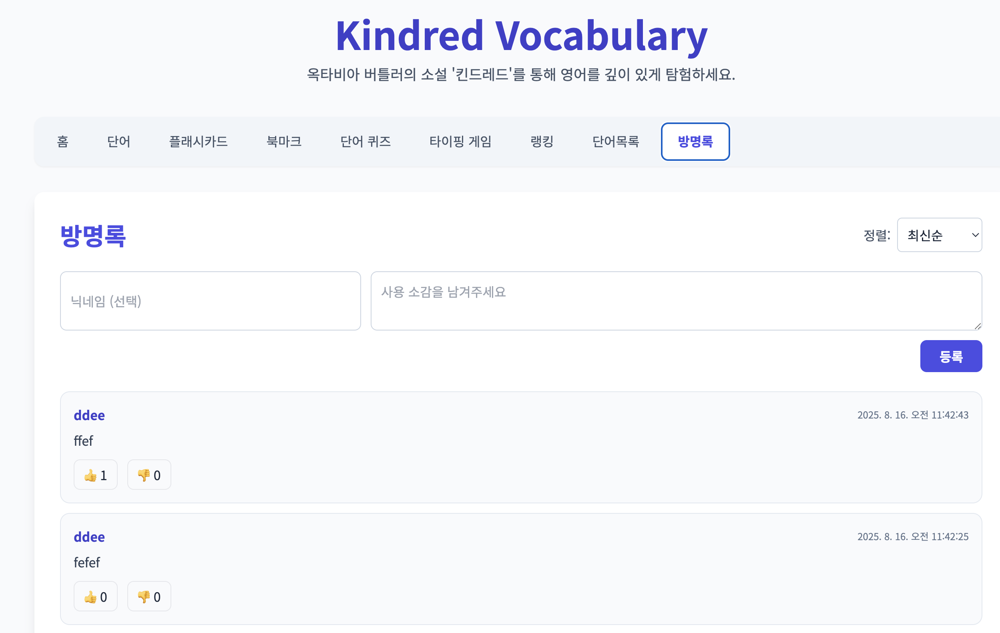

# 🌐 Kindred Vocabulary

Kindred Vocabulary는 옥타비아 버틀러의 소설 **『킨드레드』** 속 핵심 어휘를 중심으로 학습과 게임, 피드백을 결합한 웹 애플리케이션입니다.  
영어 단어 학습을 흥미롭게 하고, 사용자들이 함께 소통할 수 있도록 다양한 기능을 제공합니다.

---

## 🏠 메인 화면
사용자는 탭 메뉴를 통해 학습, 퀴즈, 게임, 방명록 등 다양한 기능에 접근할 수 있습니다.

---

## 📖 단어 학습
### 단어 카드 & 플래시카드
- 단어별 의미, 발음, 품사를 확인할 수 있습니다.
- 챕터별 선택 가능, 북마크 기능 제공.
- 플래시카드 형식으로 반복 학습이 가능합니다.

---

## 📝 종합 단어 퀴즈
- 무작위로 출제되는 객관식 문제를 풀면서 학습 효과를 점검할 수 있습니다.
- 즉시 정답 여부 확인.

---

## 🎮 타이핑 게임
- 화면에 떨어지는 단어를 빠르게 입력하여 점수를 획득합니다.
- 점수와 남은 생명(❤️)이 실시간으로 표시됩니다.

---

## 🏆 랭킹 시스템
- 타이핑 게임 결과는 실시간 랭킹에 반영됩니다.
- 상위권 사용자에게 메달 색상이 적용됩니다.

---

## 📚 단어 목록
- 전체 단어를 테이블 형식으로 탐색할 수 있습니다.
- 품사, 뜻, 파생어까지 상세히 제공.
- 검색 기능 포함.

---

## 💬 방명록
- 사용자들이 학습 소감을 익명 또는 닉네임으로 남길 수 있습니다.
- Like/DisLike 투표 가능, 정렬(최신순/좋아요순) 기능 제공.
- 본인 글에는 투표 불가.

---

✨ Kindred Vocabulary는 단순 암기를 넘어 **게임·퀴즈·소통**을 결합하여 단어 학습의 재미와 효율성을 극대화합니다.
